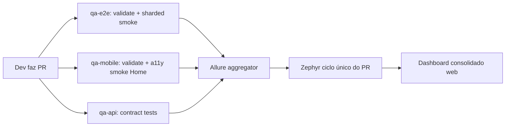

# Avaliação cruzada — Toolchain QA Youse

> Análise do engenheiro de qualidade comparando os repositórios sob `gabrielroquim-youse/*`
> e o projeto local `qa-mobile-tests-automation`. Última revisão: outubro/2025.

## 🗺️ Inventário de repositórios

| Repositório                                                                                     | Stack                                    | Foco                                              | Status                                                           |
| ----------------------------------------------------------------------------------------------- | ---------------------------------------- | ------------------------------------------------- | ---------------------------------------------------------------- |
| [`qa-e2e-tests-automation`](https://github.com/gabrielroquim-youse/qa-e2e-tests-automation)     | Playwright 1.55 + TypeScript + POM + Zod | E2E **web desktop** + a11y mobile emulado         | ✅ Maduro                                                        |
| [`qa-mobile-tests-automation`](.) (este)                                                        | Appium 2.19 + WebdriverIO 9 + TypeScript | E2E **mobile nativo** Android/iOS + a11y WCAG 2.2 | ✅ Maduro                                                        |
| `qa-api-tests-automation`                                                                       | —                                        | API/contract tests                                | ⚠️ **Não encontrado** no GitHub público de `gabrielroquim-youse` |
| [`estrutura-ambientes-youse`](https://github.com/gabrielroquim-youse/estrutura-ambientes-youse) | HTML                                     | Ambientes efêmeros por clone                      | Não escopo deste relatório                                       |

> O repositório **`qa-api-tests-automation`** retornou **404** no perfil público.
> Recomendo confirmar visibilidade com o time (pode estar em outra organização
> ou ainda privado). Sugestão de estrutura na seção [Gaps](#-gaps-identificados).

## ✅ Pontos fortes do ecossistema

### `qa-e2e-tests-automation` (web)

- **Playwright + POM + `proxymise`** para fluência (`page.login.email.fill(...)`)
- **Schemas Zod** em data factories — `generateB2CSeguroAutoData()` valida CPF/email
- **Tags consistentes**: `@smoke @journey @a11y @ux @regression @keyboard @price`
- **Sharding 4×** no CI (`--shard=${i}/4`) — paraleliza bem
- **Playwright Agents** (`planner`, `generator`, `healer`) já configurados — usa Copilot/Claude
- **A11y integrado**: smoke axe em Pixel 5 + iPad já no CI (`test:a11y`)
- **Allure + Zephyr Scale** publicando ciclos automaticamente
- **Dashboard de timing** em `docs/reports/` (espelhado por este projeto)

### `qa-mobile-tests-automation` (este projeto)

- **Suite a11y dedicada** com 9 regras WCAG (labels, touch target 48dp/44pt, focus order,
  contraste pixel-perfect, dynamic type, orientação, keyboard nav, gesture alternatives, **dark mode**)
- **Google ATF** integrado via `mobile: performAccessibilityAudit`
- **Contraste pixel-perfect** com `pngjs` (algoritmo border vs interior, threshold 4.5 WCAG)
- **CI completo** com 4 jobs: validate / gate PR a11y / smoke+a11y full / iOS (`macos-14`)
- **Dashboard A11y MD + HTML** standalone — espelha padrão do `qa-e2e`
- **Helper `auditCurrentScreen()`** para plugar a11y em specs E2E sem duplicar navegação
- **POM disciplinado** (`tests/pages/`) e seletores centralizados (`tests/helpers/selectors.ts`)
- **Zero `driver.pause`** — regra ESLint custom + helper `sleep` local

## ⚠️ Gaps identificados

### 1. `qa-api-tests-automation` ausente

Recomendo criar com:

- **Pact ou Schemathesis** para contract tests
- **Supertest + Vitest** para testes funcionais
- **OpenAPI/Swagger as source of truth** (gerar tipos com `openapi-typescript`)
- **Dashboard espelhando** o padrão de `docs/reports/` (timing, status, contratos quebrados)
- **Mesma estrutura de CI** (validate → smoke → regression)

### 2. Lacunas do `qa-mobile-tests-automation`

| Gap                                    | Impacto                         | Sugestão                                                                                  |
| -------------------------------------- | ------------------------------- | ----------------------------------------------------------------------------------------- |
| Sem **Playwright Agents** equivalentes | Geração manual de specs         | Adaptar `agents/healer.md` para Appium (sugerir seletor alternativo via Appium Inspector) |
| Sem **integração Zephyr**              | Cycles não publicam             | Replicar `tools/zephyr/` do `qa-e2e` (mapa `caseKey` → spec)                              |
| Sem **sharding**                       | Runs longos serializam          | `--maxInstances 2` por suite + matriz `[smoke, a11y, e2e]` no CI                          |
| Sem **performance profiling**          | Não medimos jank/FPS do Flutter | Adicionar `mobile: startPerfRecord` e gravar trace                                        |

### 3. Lacunas do `qa-e2e-tests-automation`

| Gap                                      | Sugestão                                                                        |
| ---------------------------------------- | ------------------------------------------------------------------------------- |
| A11y mobile só emulado (Chrome DevTools) | Cross-link este projeto: `@a11y @native` cobre o real                           |
| Contraste via axe-core                   | Comparar com nosso pixel-perfect para detectar falsos negativos                 |
| Dark mode não testado                    | Replicar nosso `checkDarkMode` via `page.emulateMedia({ colorScheme: 'dark' })` |

## 🔀 Estratégia integrada (recomendação)

### Próximos passos sugeridos (ordem de prioridade)

1. **Confirmar ou criar `qa-api-tests-automation`** com schemas Zod compartilhados com `qa-e2e`
2. **Publicar dashboards** em GitHub Pages (este projeto já gera HTML — falta o step `actions/deploy-pages`)
3. **Integrar Zephyr** no mobile (replicar `tools/zephyr/` do `qa-e2e`)
4. **Sharding por suite** no CI mobile (matrix `[smoke, a11y, e2e]`)
5. **Profile/perf trace** no E2E mobile usando `mobile: startPerfRecord`
6. **Playwright Agent "appium-healer"** que lê hierarchy XML e sugere seletor alternativo

## 📚 Referências para o time

- [WCAG 2.2 AA Quick Reference](https://www.w3.org/WAI/WCAG22/quickref/)
- [W3C Mobile Accessibility Guidelines](https://www.w3.org/TR/mobile-accessibility-mapping/)
- [Material — Touch targets 48dp](https://m3.material.io/foundations/designing/structure)
- [HIG — Touch targets 44pt](https://developer.apple.com/design/human-interface-guidelines/accessibility)
- [Google ATF](https://github.com/google/Accessibility-Test-Framework-for-Android)
- [Playwright Agents](https://playwright.dev/docs/test-agents)

---

_Atualize este documento ao adicionar um repositório novo ou alterar a estratégia._
